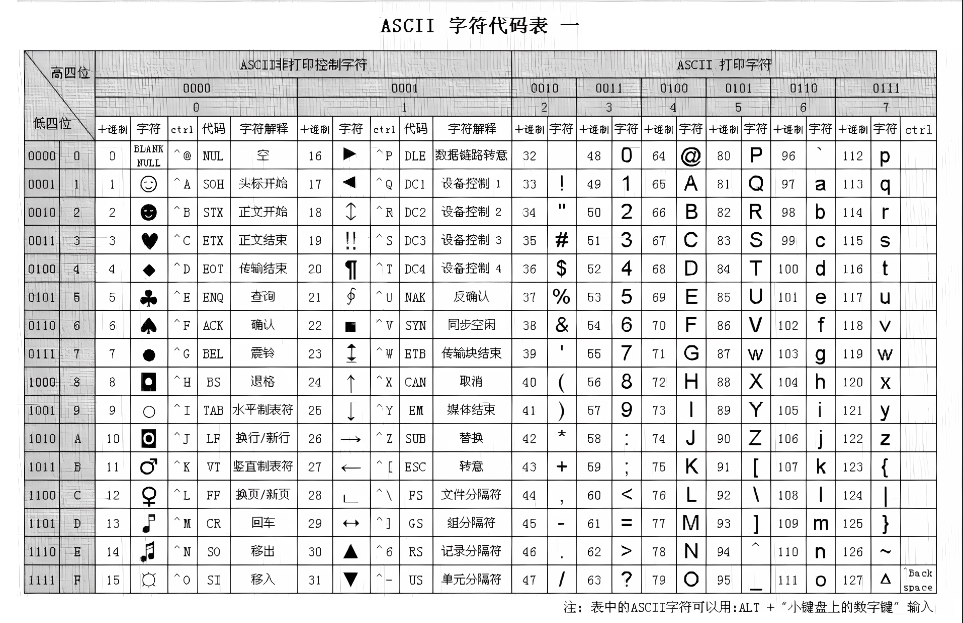

## cpp
1. 数制转换
    - cout 默认以十进制显示
    - count<<oct 显示八进制
    - count<<hex 显示十六进制
    - count<<bitset<?> 显示二进制(?表示需要显示的二进制位数) 需要引入bitset头文件
    - cin 还会自动跳过 空格 回车 制表符 将分段输入的变量一次性赋值给多个变量
    - cin默认按照空格 制表符分段赋值变量 使用cin.getline或cin.get改为读取换行符
    - cin.getline读取到换行符并改为空字符 cin.get读取到换行符不存储换行符
2. 几个编码建议
    - cpp几乎不使用宏
        - 使用const enum代替常量宏 const类型变量都大写方便识别
        - 使用inline代替宏函数(函数体量小且被频繁调用)
    - 必要在使用变量前先声明 保证变量都会被立刻初始化 定义指针 一定要初始化为一个确定的适当的地址
    - 内存的创建与销毁 
        - 使用new替代malloc 
        - 使用delete代替free
    - 尽量少使用数组和c风格的字符 
        - 使用string代替char *
        - 使用vector和array代替数组
    - 避免使用void * 指针算数 0 NULL nullptr都是空指针
    - 将程序设计由一堆类和对象表达相互作用 而不是一堆数据结构和可拨弄的二进制数据那样既不方便操作也容易造成安全问题
    - 头文件应该只包含 函数原型 结构声明 类声明 模板声明 内联函数 使用#define或const定义的符号常量
3. 存储空间
   - 作用域(scope) 描述了名称(函数 变量 命令空间等)在单元(文件 项目 平台等)的可见范围
   - 连接性(linkage) 描述了名称在不同单元之间的共享性
   - 存储持续性 描述了数据在内存中存储空间和时间的方案
     - 自动存储空间(栈 stack) 在函数中声明的变量包括函数参数 近当前函数内可见 无连接性
     - 静态存储空间 在函数外定义的变量和static变量 在整个程序运行过程中存在 编译器将分配固定的内存块来存储所有的静态变量
     - 自由存储空间(堆 heep free store) 使用new开启的内存 直到使用delete释放或程序运行结束
     - 线程存储空间 使用thread_local声明 c11新增
   - auto 声明变量时根据初始化表达式自动推断该变量的类型 c17已废弃
   - register 定义存储在寄存器中而不是 RAM 中的局部变量 c17已废弃
   - volatile 并发编程中保证共享数据的同一性
   - mutable 为const限定的结构 类中某些属性解除const
   - |存储描述|持续性|作用域|连接性|      如何声明      |
     |:-:|:-:|:-:|:-:|:-:|
     |自动|自动|代码块|无|代码块内 使用auto(可省略)|
     |寄存器|自动|代码块|无|代码块内 使用register|
     |静态 无连接性|静态|代码块|无连接性|代码块内 使用关键字static|
     |静态 内部连接性|静态|文件|内部连接性|代码块外 使用关键字static|
     |静态 外部连接性|静态|文件|外部连接性|代码块外|
4. 基本数据类型(默认都是signed类型)
   - bool 只包含true false 所有非0都自动转化为true 0转化为false
   - char 至少1byte=8bit
   - short  至少2byte=16bit  -2^15~2^15-1(-32768~32767) 0~2^16-1(0~65535)
   - int  至少和short一样长
   - long  至少4byte=32bit 且至少和int一样长
   - long long  至少8byte=64bit 且至少和long一样长 c11新增
   - float  至少4byte=32bit 使用后缀f或F标识
   - double  至少6byte=48bit 且至少和float一样长 通常为8byte=64bit 使用后缀d或D标识 浮点数默认初始化为double
   - long double 至少和double一样长 一般有10byte=80bit 12byte=96bit 16byte=128bit 使用后缀l或L标识 尽量使用L避免认读歧义
5. 字符
   - 
   - wchar_t 常用的字符可用用char 需要支持unicode编码字符使用宽字符 一般默认和short占内存大小一致
   - cin cout 默认是char字符流不适合处理wchar_t 可用用wcin wcout 通过加前缀L标识宽字符
   - char16_t 16bit无符号字符使用前缀u 用于代替wchar_t c11新增
   - char32_t 32bit无符号字符使用前缀U 用于代替wchar_t c11新增
6. 引用
   - 使用引用参数的主要原因有两个
      - 程序员能够修改调用函数中的数据对象
      - 通过传递引用而不是整个数据对象 可以提高程序的运行速度
   - 对于使用传递的值而不作修改的函数
      - 如果数据对象很小 如内置数据类型或小型结构 则按值传递
      - 如果数据对象是数组 则使用指针 因为这是唯一的选择 并将指针声明为指向const的指针
      - 如果数据对象是较大的结构 则使用const指针或const引用 以提高程序的效率这样可以节省复制结构所需的时间和空间
      - 如果数据对象是类对象 则使用const引用 传递类对象参数的标准方式是按引用传递
   - 对于修改调用函数中数据的函数
      - 如果数据对象是内置数据类型 则使用指针
      - 如果数据对象是数组 则只能使用指针
      - 如果数据对象是结构 则使用引用或指针
      - 如果数据对象是类对象 则使用引用
   - 不要返回指向局部变量或临时对象的引用 函数执行完毕后 局部变量和临时对象将消失 引用将指向不存在的数据
   - 如果方法或函数要返回局部对象 则应返回对象 而不是指向对象的引用 在这种情况下 将使用复制构造函数来生成返回的对象 
   - 如果方法或函数要返回一个没有公有复制构造函数的类(如ostream类)的对象 它必须返回一个指向这种对象的引用 
   - 最后 有些方法和函数(如重载的赋值运算符)可以返回对象 也可以返回指向对象的引用 首选引用效率更高 
7. 命名空间
   - 使用在已命名的命名空间中声明的变量 而不是使用外部全局变量 也不是使用静态全局变量
   - 如果开发了一个函数库或类库 将其放在一个命名空间中
   - 不要在头文件中使用using编译指令 首先这样做掩盖了要让哪些命名空间可用 另外包含头文件的顺序可能影响程序的行为
   - 如果非要使用编译指令using应将其放在所有预处理器编译指令#include之后
   - 导入命名空间时 首选使用作用域解析运算符或using声明的方法 对于using声明 首选将其作用域设置为局部而不是全局
8. 类
   - 将类拆分成类定义(头文件)和类声明(具体实现)
   - 函数体较小(<=5行)时 宜将函数体写在类定义中 默认有函数体的成员函数会被加载为内联函数
   - 构造函数应覆盖全部的private成员 并使用explicit禁止自动类型提升
   - 构造函数 复制函数 析构函数都有对应的默认实现 可以不显示声明
   - 如果类中有使用到指针 引用或其他类应该实现析构函数 完成对内存的释放
   - 当类内部需要使用复杂的数据结构如指针 引用 结构体或其他类 最好提供复制构造函数 避免隐式创建对象时没有只复制到成员地址而没有复制到具体的数值
   - friend将函数变为友元函数 可以允许该类函数访问到private变量
   - 继承父类 会继承protect public成员和函数
   - virtual将函数置为虚函数 如果子类函数需要覆盖实现 应在函数后加override 虚函数帮助程序实现多态可以正确访问到对应的函数
   - 构造函数不能是虚函数 如果类需要被继承 析构函数应该是虚函数
   - =0表示该方式使虚函数变为纯虚函数(抽象方法) 可以不提供具体实现 该类成为抽象类
9. 联编
   - 静态编译(static binding) (early binding) 针对非虚函数 效率更高
   - 动态编译(dynamic binding) (late binding) 针对虚函数
   - 向上转换(upcasting) 将子类指针或引用转换为父类指针或引用 默认允许 是安全操作
   - 向下转换(downcasting) 将父类指针或引用转换为子类指针或引用 默认不可实现需要强制转换 不安全操作