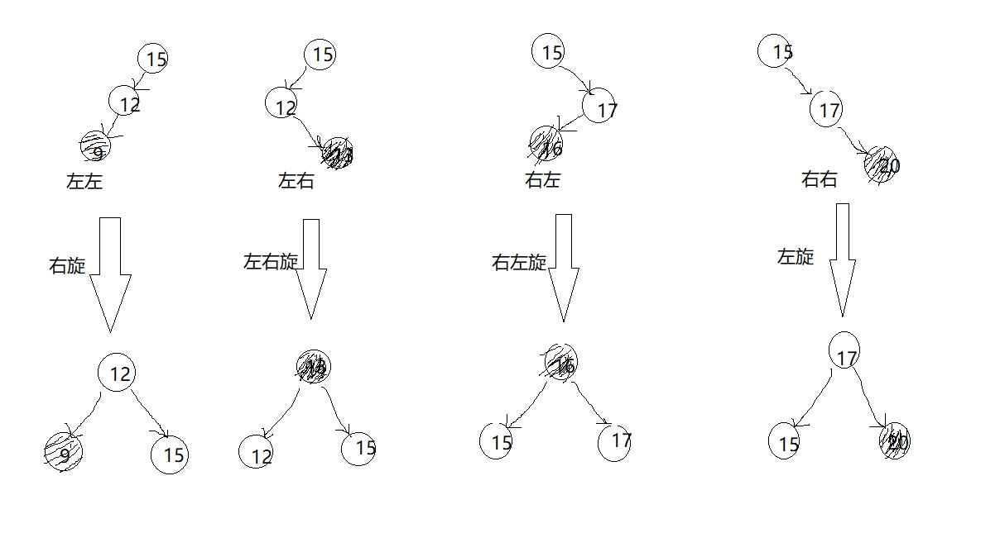

### 模糊分类
1. 逻辑结构  
    - 链表
    - 栈
    - 队列
    - 树
    - 图
    - 网
    - 拓扑
2. 存储结构  
    - 顺序存储
    - 链式存储
    - hash存储
3. 算法  
    - 初始化
    - 销毁
    - 查找
    - 插入
    - 删除
    - 旋转
4. 线性结构  
    - 节点之间有且仅有一个后继后或前继节点
    - 通过某节点一定可以找到它的后继后或前继节点
5. 非线性结构  
    - 节点之间存在0个或多个后继后或前继节点
    - 不能通过节点直接找到某个后继后或前继节点
6. 树
    - 有且就有一个根节点且根节点没有前继节点
    - 所有节点有且仅有一个前继节点(根节点除外)
    - 所有节点都会有0个或多个后继节点
    - 二叉树:所有节点有0个1个或2个后继节点
    - 完全二叉树:所有节点有0个或2个后继节点
    - 二叉搜索树(BST):节点数据按照小中大或大中小规则存储的二叉树
        - 先序遍历: 根->左->右
        - 中序遍历: 左->根->右
        - 后序遍历: 左->右->根
        - 按层遍历
    - 树的平衡:左右子树的高度差绝对值小于等于1即为平衡树
        - 左左不平衡:右旋
        - 左右不平衡:左旋->右旋
        - 右左不平衡:右旋->左旋
        - 右右不平衡:左旋
    - 旋转:插入删除节点后检查树是否平衡 若不平衡则需要旋转树使恢复平衡
    - 绝对平衡二叉树(AVL):永远保持平衡的BST
### 具体结构
1. [单向链表](linked_list.jpg)
    
2. [双向链表](linked_list2.jpg)
    
3. [双向循环链表](linked_list2.jpg)
    
4. [顺序队列(循环队列)](seq_quene.jpg)
    
5. [链式队列](linked_quene.jpg)
    
6. [顺序栈](seq_stack.jpg)
    
7. [链式栈](linked_stack.jpg)
    
8. [BST](bst.jpg)
    
9. [AVL](avl.jpg)
    